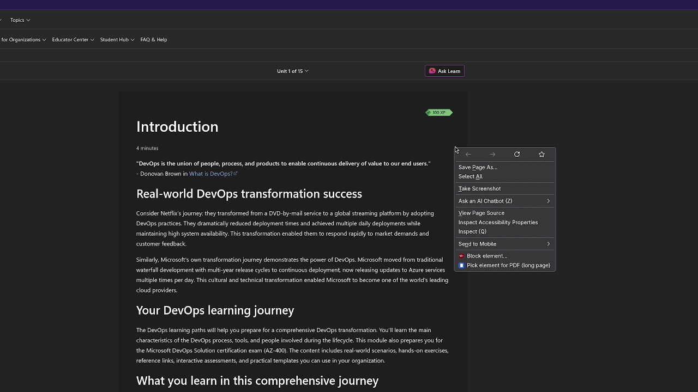

# DOM to PDF Picker (Firefox build)

Browser extension (Manifest V3, Firefox) that lets you pick any element on
a page and save it as a PDF with real, selectable text and images. No
rasterization.

This is the Firefox branch - `manifest.json` here uses
`background.scripts` plus `browser_specific_settings.gecko.id`. There's a
separate `chromium` branch with the `background.service_worker` variant;
the rest of the code is identical between the two.

No dependencies, no build step, plain JS. Printing goes through the
browser's native `window.print()` with an injected `@media print`
stylesheet - it's not html2canvas, jsPDF, html2pdf or anything like that.

## Files

- `manifest.json` - MV3 manifest for Firefox.
- `background.js` - icon click, context menu, keyboard shortcut. Injects
  `printer.js` and `picker.js`.
- `picker.js` - the hover/highlight overlay and keyboard navigation.
- `printer.js` - builds the print CSS, preps images/canvas/scroll/fixed
  elements, calls `window.print()`, cleans up afterwards.
- `options.html` / `options.js` - settings page.
- `icons/` - 16/48/128 PNG + source SVG.

Permissions: `activeTab`, `scripting`, `commands`, `storage`, `contextMenus`.
No host permissions, no network calls.

## Installing it

Open `about:debugging#/runtime/this-firefox`, click Load Temporary Add-on
and pick `manifest.json` in this folder. It unloads when Firefox restarts
since it's not signed - that's normal for a temporary install. Permanent
installation needs signing through addons.mozilla.org.

## Using it

Start the picker one of three ways - they all do the same thing:
right-click a page and choose "Pick element for PDF (long page)", click
the toolbar icon, or hit Alt+Shift+P.

Then:
- Hover to highlight elements; the badge shows the selector and size.
- Arrow keys walk the DOM without touching the mouse: up = parent, down =
  first child, left/right = siblings.
- `M` flips between print mode A and B for this pick.
- Enter or click confirms and opens the native print dialog.
- Esc cancels, no leftover attributes or styles.
- Pick "Save as PDF" as the destination.

## Long pages

Rather than splitting content across A4/Letter sheets, the extension
measures the height of the selected element and sets a custom
`@page { size: 210mm <height>mm; }` so the whole thing prints as one
continuous page. This only really makes sense with "Save as PDF" as the
destination (a real printer obviously can't handle that page length), and
the print dialog will show "Custom" as the paper size, which is expected.
Height is estimated from `scrollHeight`, so unusual layouts might be
slightly off - there's also a ~5m cap as a sanity limit.

## Mode A vs Mode B

Mode A (default) marks the target element and its ancestor chain with
`data-pick*` attributes and injects a print stylesheet that hides
everything else, flattens the ancestors, and stretches the target to full
width. Everything gets cleaned up on `afterprint`. It's the more faithful
option since it prints the actual styled page.

Mode B deep-clones the target into a hidden iframe and copies over just
the print-relevant computed styles inline, absolutizes image URLs, and
swaps canvases for images. Use it when a page's CSS is aggressive enough
that Mode A doesn't look right.

Default mode is set in the options page; `M` overrides it for a single
pick.

## Options

- Page margin (mm)
- Print mode (A/B)
- Force background colors/images - sets `print-color-adjust: exact`, but
  you still need "Background graphics" turned on in the browser's print
  dialog for it to actually show up in the PDF. That's a browser setting,
  not something a page can force.
- Append source URL - adds `location.href` as a small line under the
  printed content.

## Known limitations

- Lazy images get `loading="eager"` and are awaited/decoded before
  printing.
- Scrollable containers get expanded (`overflow:visible`) instead of
  clipping to their on-screen height.
- `position: fixed`/`sticky` elements are forced static so they don't
  repeat on every page.
- Canvases are swapped for a `toDataURL()` image; a cross-origin-tainted
  canvas just gets skipped.
- Shadow DOM works via `event.composedPath()` and walking `.shadowRoot`,
  but only open shadow roots - closed ones are inaccessible by design.
- Selecting inside a foreign `<iframe>` is blocked (separate document, out
  of reach); Mode B replaces nested iframes with a placeholder instead.
- No custom PDF engine, no headers/footers/page numbers, no multi-element
  PDFs, no `chrome://`/`about:` pages (extensions can't inject there).

## Troubleshooting

- Nothing happens on click/shortcut/menu: make sure you're on a regular
  `http(s)://` page, then check the service worker console
  (`chrome://extensions` -> Details -> Inspect) for a warning.
- Stale context menu entry after editing the code: reload the extension,
  `background.js` rebuilds the menu on every start.
- No background colors in the PDF: enable "Background graphics" in the
  print dialog too.
- Output looks different from the live page: try Mode B (`M` while
  picking).
